# AAPS — SmartInsulin APS Plugin

> 💬 **SmartInsulin Discord:** [Join the server here](https://discord.gg/Jezqptxp) — if there's any questions, come in and ask away!

> 📖 **Full AAPS Wiki:** https://wiki.aaps.app
>
> 📋 **3-day survey** (required after looping for 3 days): https://docs.google.com/forms/d/14KcMjlINPMJHVt28MDRupa4sz4DDIooI4SrW0P3HSN8/viewform

---

> **⚠️ Medical Disclaimer**
> SmartInsulin is not a medical device and has not been approved by any regulatory authority. It is intended for experienced closed-loop users only. Use entirely at your own risk. Always have fast-acting glucose available. The authors accept no liability for any outcomes resulting from use of this software.

---

## What is SmartInsulin?

SmartInsulin is a custom APS (automated insulin delivery) plugin for AndroidAPS. It replaces the standard OpenAPS algorithm with one that **learns how your body responds to insulin** and slowly adjusts itself — so you don't have to keep tuning every setting by hand.

In plain words, it watches your BG every 5 minutes and learns:

- How strong your insulin is at each hour of the day, and on each day of the week
- What your basal rate should be at each hour
- Whether it has been giving too much insulin (lows) or too little (highs)
- How each type of meal behaves, so the next one goes better
- When you have eaten, even if you didn't tell it

Everything it learns is written down in a **Learning Journal** on the SmartInsulin tab, in real numbers (for example `ISF 2.00 → 1.95 mmol/U`), so you can always see what changed and why.

<p align="center">
  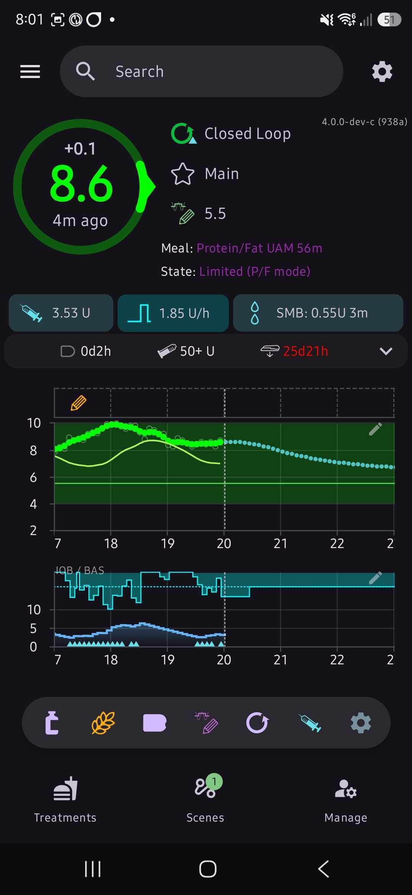
  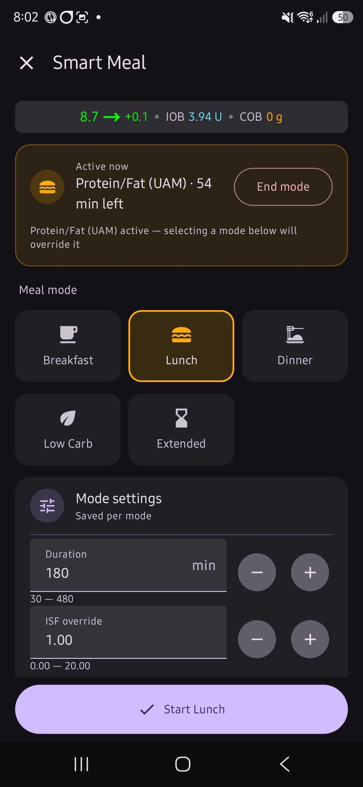
</p>

---

## Which branch?

| Branch | AAPS version | Status |
|--------|--------------|--------|
| **`main`** | **AAPS 4.0** | Current version — this README |
| `dev` | AAPS 3.4 | Older version, no longer updated |

Build the **`fullRelease`** variant from `main` in Android Studio.

---

## Requirements

- AndroidAPS **4.0** (this branch)
- Dexcom G6/G7, Libre, or another CGM supported by AAPS
- A pump supported by AAPS (tested with Omnipod DASH)
- Android 9 or newer

---

## How it Works

> 💡 **A note on carbs:** SmartInsulin does **not** use carb entries to decide doses. It works from your ISF, where your BG is heading, and the insulin you already have on board. Carbs you eat still count — they show up as BG rising, and the loop doses for that.

### Every 5 minutes, SmartInsulin:

1. Reads your BG, how fast it is moving, and how much insulin is on board
2. Predicts your BG for the next 4 hours — the same way stock AAPS (oref) does it, using AAPS's own insulin numbers
3. Works out how much insulin is needed to bring that prediction to your target
4. Runs the safety checks (below)
5. Gives an SMB and/or sets a temp basal

### Reading the prediction line

The prediction line shows **where your BG ends up with the insulin you have now**:

- With insulin on board, the line bends down as that insulin works.
- With no insulin on board, it shows the current rise fading out over an hour, then goes **flat**. Flat means "no insulin working" — that is normal.

---

## The Learning System

Several learners run in the background. Each one has a simple job:

| Learner | What it learns |
|---------|---------------|
| **Circadian** | Your ISF and basal for **each hour of each day of the week**. Tuesday 9am can learn something different from Wednesday 9am. |
| **Aggressiveness** | Whether the loop has been too strong or too weak over the last 24 hours, based on your Time in Range |
| **FuelTrim** | A short-term trim: when BG sits high or low for a while at one hour, it adds or takes away a little insulin for that hour |
| **Meal ISF** | A correction for **each meal mode** (Breakfast, Lunch, UAM Dinner…), learned from how each meal ended |
| **UAM entry** | How much to front-load the first SMBs when an unannounced meal is detected |
| **DURA strength** | How hard to push when BG gets stuck high after a meal (see DURA below) |
| **Insulin peak** | How fast your insulin peaks. **DIA is not learned** — it always uses your insulin's DIA from AAPS |
| **Activity sessions** | How a round of golf or a gym session changes your sensitivity |

### When learning pauses

Learning stops when its data would be wrong:

- During meal modes, and for a set time after a meal ends (post-meal pause)
- During high temp targets, activity, and CGM warmup
- **While BG is below target, and for 90 minutes after.** The climb back up from a dip (from held-back basal and your liver) is not "basal too weak", so nothing may make ISF or basal stronger in that time. Making them weaker is still allowed.

The overview shows the learning state under **State:**, for example `Learning`, `Post-meal pause — 44m remaining`.

### How Meal ISF learning judges a meal

When a meal mode ends, it is judged on what happened **during the mode**:

| What happened | Result |
|---------------|--------|
| A spike held over target for 30 min (see the bar below) | Meal ISF **stronger** |
| BG still about 1 mmol or more above target when the mode ended | **Stronger** |
| BG ended near target | No change (but it counts as a meal) |
| A low during the mode | **Weaker** |

How high a spike may go before it counts:

- **3 mmol over target** — a Smart Meal **with** a pre-bolus (the pre-bolus should keep it down)
- **4 mmol over target** — a Smart Meal **without** a pre-bolus, and every UAM meal (an unannounced meal on fast insulin often rises 3 mmol)

Then, for 75 minutes after the mode ends:

- **BG drops low or close to low** → any "stronger" from the mode end is **undone**, and the meal goes **weaker**. So "ended high, then crashed" always ends up weaker.
- **BG still high at the end** → **stronger**, if the mode end did not already make it stronger. Never twice for one meal.
- **Another mode starts** (for example Protein/Fat takes over) → the tail stops. The meal keeps the verdict it already got.

A low that you were **already in when you started a mode** is not blamed on that mode.

### The Learning Journal

The SmartInsulin tab has a **Learning Journal** that lists every change, newest first, for the last 14 days:

```
Today 20:36  Meal ISF   BG near the low guard after Dinner (UAM) ended … — weakened
                        at reduced step, and the strengthen at mode end undone:
                        ISF 1.94 mmol/U → 2.05 mmol/U (n=1)
Today 18:01  Circadian  Fri 17:00 — ISF 2.59→2.54 mmol/U (stronger)
Today 16:21  FuelTrim   started at 16:00 — sustained low, reducing insulin (5.9%)
```

If an hour only moved because it drifted back toward its weekly average (not because of BG), the entry says so.

### How the circadian trim works

Think of a car's fuel trim. The goal is a profile where the loop sits near **aggressiveness = 1.0** — it does not need to keep adding or taking away insulin to stay on target.

- If an hour keeps needing **less** insulin → ISF goes **weaker**, basal goes **down** for that hour
- If an hour keeps needing **more** insulin → ISF goes **stronger**, basal goes **up** for that hour

Short-term changes (FuelTrim, the aggressiveness nudge) only change *today's* bucket. When nothing is pushing, today's value slowly drifts back toward that hour's weekly average. Slow, BG-based learning changes the weekly average itself.

### Learning bias

One setting, **Learning bias** (0 = very conservative, 2 = neutral, 4 = very reactive), sets how hard the meal and UAM learners chase highs. Steps that **take insulin away** never get smaller, whatever this is set to.

---

## Safety Gates

Before any insulin is given, these checks run:

| Gate | What it does |
|------|-------------|
| **LGS threshold** | BG is below it **now** → zero basal, no SMBs |
| **Low guard** | BG is **predicted** to go below it → zero basal, no SMBs |
| **Warn guard** | Prediction is getting close to the low guard → basal reduced |
| **Max IOB** | A red line: SMBs and temp basals may fill up to max IOB, never past it. At or over max IOB, basal goes no higher than profile. |
| **Low recovery window** | After a low, basal restarts at 30% and ramps up to 100%; SMBs are blocked for the first 75% of the window |
| **High temp target** | SMBs blocked |
| **CGM warmup** | Smaller SMBs in the first 24 hours of a new sensor |

### Low guard vs LGS — what's the difference?

- **LGS threshold** looks at your BG **right now**. Below it, insulin stops. A hard floor.
- **Low guard** looks at your **predicted** BG. If it is heading below, insulin stops **before** it happens.

**Tip:** set both to the same value (for example 4.5 mmol / 80 mg/dL), and the warn guard a little higher (for example 4.9 mmol / 88 mg/dL).

BG counts as "below the low guard" when **the number on the screen** is lower than the guard — `4.7` against a `4.8` guard is a low, `4.8` against `4.8` is not.

### Low guard on the overview

The **State:** line on the overview shows the low guard:

- **Low guard** (red) — BG is under the low guard
- **Low recovery — 23m left** (amber) — back above it, recovery window counting down

### Low recovery window

After a low, SmartInsulin runs a recovery window (20–90 min, default 60):

- Basal starts at 30% and ramps back to 100%
- SMBs are blocked at first, then ramp back in
- Going low again during the window starts it again, and a real second low makes it longer

**Meal modes skip the recovery taper** — if you start a meal mode, the loop doses for the meal.

### Pattern safety

* **Rollercoaster detection:** BG crossing your target 2+ times in 90 minutes caps that hour's aggressiveness, so corrections get gentler until things settle.
* **Soft low approach:** BG dropping toward the low guard with insulin on board cuts aggressiveness to soften the landing.

---

## Meal Modes

Start a meal with the **Smart Meal** button (it has the same icon as Carbs).

### Smart Meal dialog

- Pick a mode: **Breakfast, Lunch, Dinner, Low Carb, Extended**
- Each mode has its own ISF (shown in the dialog, and saved for next time)
- Set how long the mode lasts
- **Pre-bolus 1** — given straight away when you press Start
- **Pre-bolus 2 and 3** — given later, after a delay you choose. Each one waits until it is safe (BG above target, IOB not too high, BG not falling)
- **DURA** — on/off and strength, per meal (see below)
- The **Active now** card shows the running mode, time left and any pending pre-boluses

The overview shows the mode as `Meal: Lunch 120m` (Smart Meal) or `Meal: Lunch UAM 90m` (detected).

### DURA

DURA makes ISF **stronger when BG gets stuck high** after a meal — a plateau that won't come down, often from fat or protein. Each mode has its own DURA settings, and the **DURA strength learner** (can be switched off) learns how hard each mode needs it.

### Post-meal pause

After a meal mode ends, learning pauses for a set time (default 90 min) so a slow fat/protein tail is not learned as "basal too low".

---

## UAM Auto-Detection (unannounced meals)

SmartInsulin watches for the BG rise of a meal you didn't announce, and starts the right meal mode by itself.

### How it decides

A meal is detected after a few rising readings in a row (default 3), when:

| Check | Default | Meaning |
|-------|---------|---------|
| BG above trigger | 5.5 mmol / 99 mg/dL | Not near target |
| Each reading rising | 0.15 mmol / 2.7 mg/dL | BG is going up |
| 15-min trend rising | 0.11 mmol / 2.0 mg/dL | The trend agrees |
| Rise insulin can't explain | 0.11 mmol / 2.0 mg/dL | It's food, not a basal wobble |

- **Burst trigger:** a fast rise from the recent low point (default 1.0 mmol / 18 mg/dL) starts UAM straight away.
- **Wobble tolerance:** one weak reading in the middle doesn't break the streak if the trend still holds.
- After a meal, thresholds are raised about 1.5× for a while, so a fat/protein tail is not seen as a new meal.

### UAM windows

| Window | Notes |
|--------|-------|
| UAM Breakfast | Your own hours, duration and ISF |
| UAM Lunch | " |
| UAM Afternoon | Fills the gap between lunch and dinner |
| UAM Dinner | " |
| UAM Snack | Late evening |

### UAM entry SMBs

The first few SMBs after UAM starts are given at a fraction (default 0.5, range 0.1–1.0, can be set per window). This softens the start while the insulin catches up. The **UAM entry learner** tunes this fraction from how each meal went.

### Protein/Fat (P/F) mode

Starts when BG is raised but **flat** after a meal — the slow rise from fat and protein.

- Its own ISF, with **three time windows**: overnight, day and night
- Its own DURA settings
- **P/F takeover:** if you eat again while P/F is running, a real meal rise in a UAM window can replace P/F with that meal mode

---

## CGM and Smoothing

### Dexcom G7

Use **Unscented Kalman Filter (UKF)** smoothing in Config Builder. It cleans up G7 noise well.

UKF has one weak spot: at the **top of a rise** it keeps saying "still rising fast" for a reading or two after the real rise has stopped, and the loop could keep dosing into the peak. SmartInsulin watches the raw G7 readings for this:

- The rise slows sharply on one reading → it uses halfway between the raw and smoothed rise
- The slowdown is still there on the next reading → it uses the raw rise
- The rise picks back up → normal UKF again

This can only ever **take insulin away**, never add it. When it acts, the loop reason shows `riseSlowing(...)`.

### Dexcom G6

The G6 is already smoothed by the Dexcom app before AAPS sees it. UKF is optional.

---

## Activity

### Heart rate and steps

SmartInsulin reads heart rate and steps (from a watch, or your phone's own step counter). Higher activity raises your BG target and pauses learning.

| Level | Loop behaviour |
|-------|----------------|
| Sedentary | No change |
| Light | Small target raise, learning paused |
| Moderate | Bigger target raise, learning paused |
| Heavy | Large target raise, learning paused |

### Activity sessions — Golf and Gym

On the SmartInsulin tab, start a **Golf** or **Gym** session before you go. During the session, ISF is made easier and insulin is tapered off before the end. SmartInsulin learns from each session how much easier, and when to start the taper.

---

## Dawn Phenomenon

Set your dawn window hours, and how much SMBs are reduced during it.

---

## SmartInsulin Tab

| Section | What it shows |
|---------|--------------|
| **Summary** | Current ISF, basal and aggressiveness at a glance |
| **General** | What the loop is doing this hour: mode, ISF and basal with how each was worked out |
| **Activity / Stress Session** | Start Golf or Gym, and what it has learned |
| **Time in Range** | Fasting and meal TIR bars, estimated HbA1c and average BG |
| **Circadian 24h** | ISF (mmol/U), basal (U/h), ceiling and confidence for every hour. Day selector Mon–Sun. Current hour highlighted. |
| **Learning Journal** | Every learned change, newest first |
| **Learned Insulin Profiles** | Learned peak per meal type (DIA is your insulin's) |
| **Learned Meal ISF / DURA / UAM entry** | What each meal learner has learned, per mode |
| **Reset** | Reset buttons for each learner |

<p align="center">
  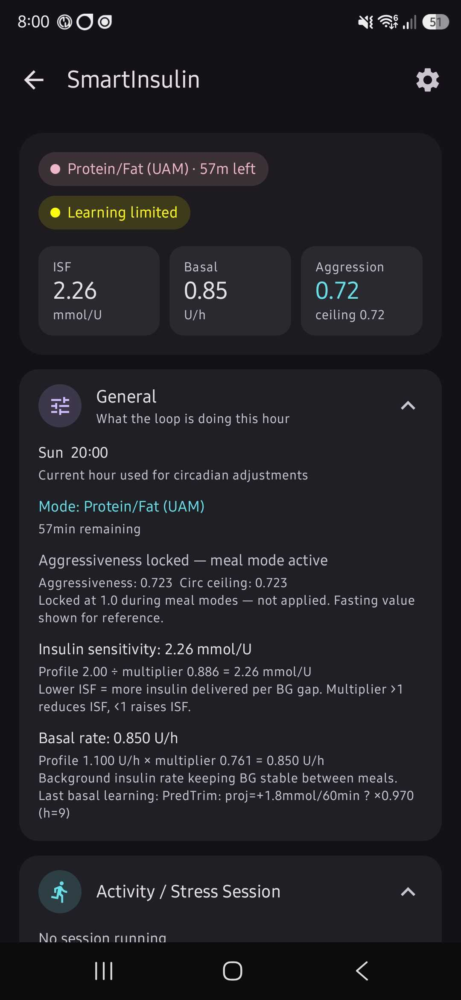
  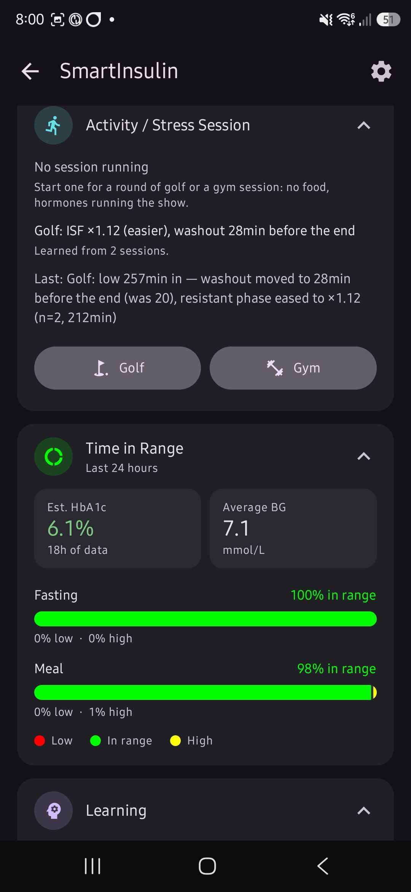
  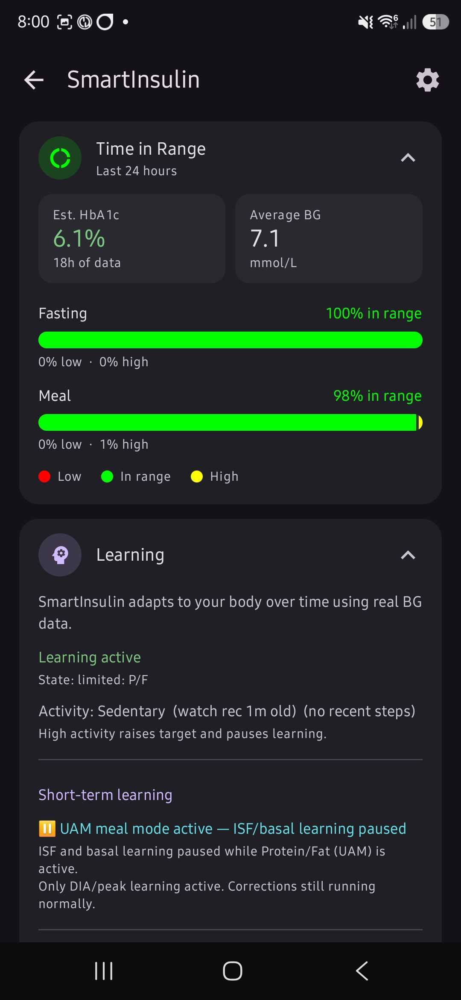
  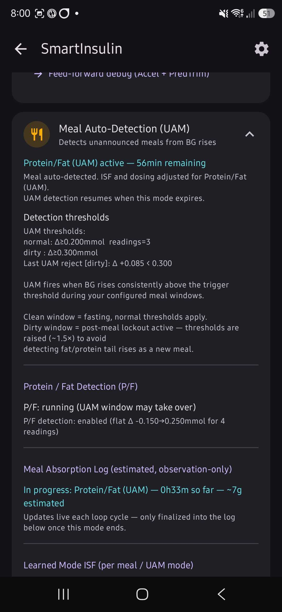
  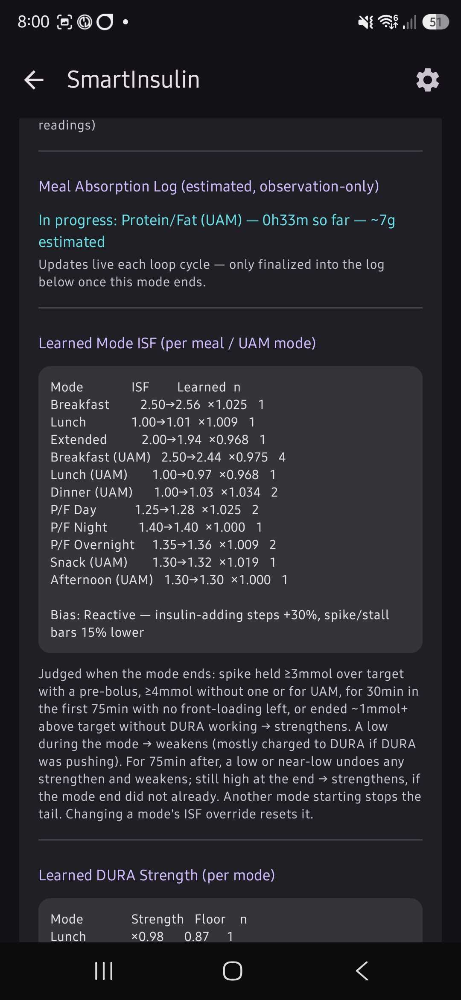
  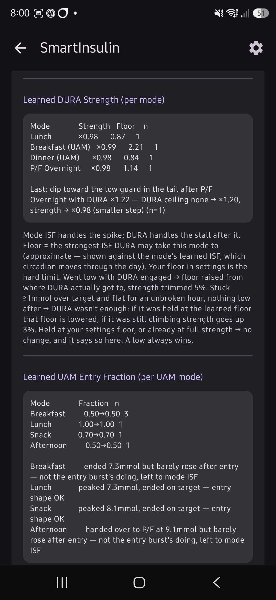
  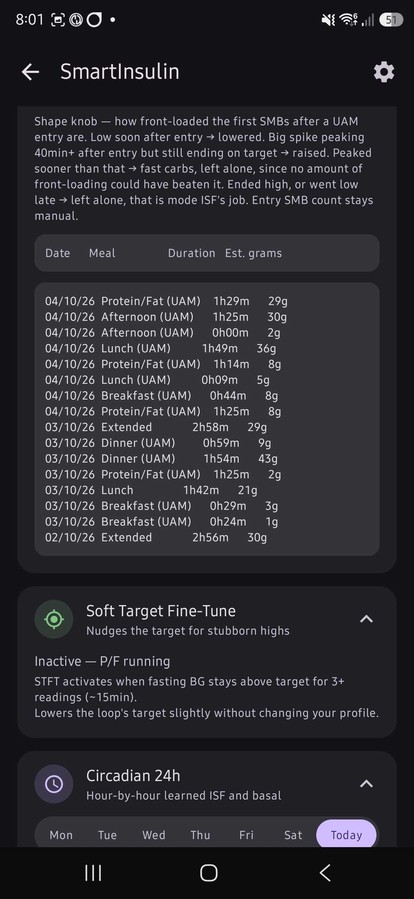
  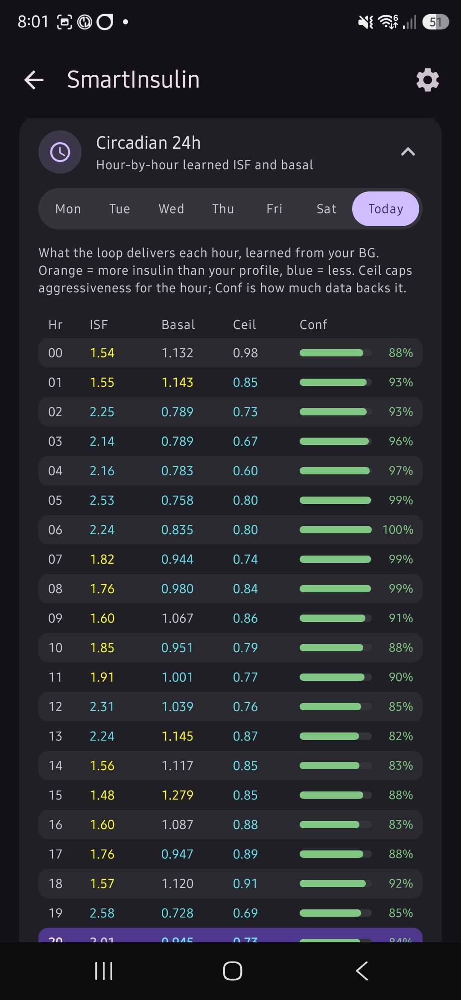
  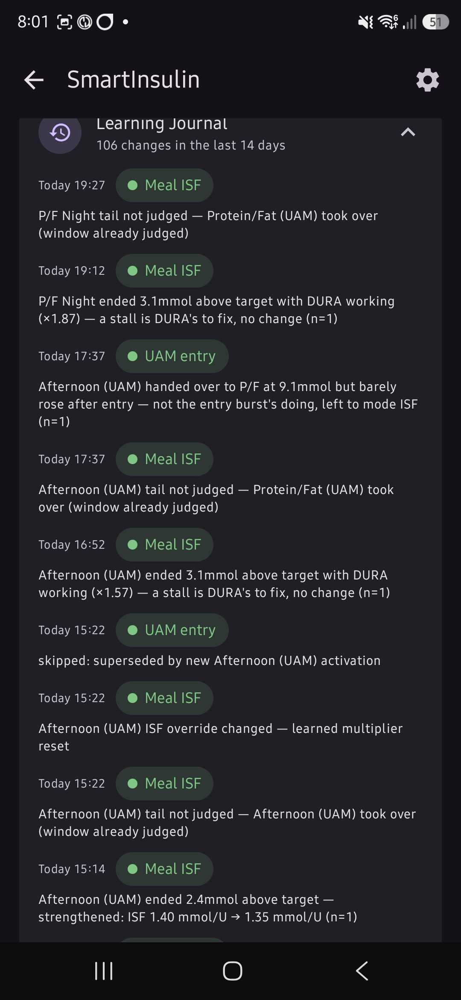
  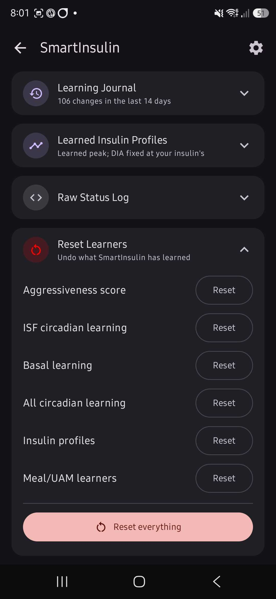
</p>

---

## Loop Output Format

The Loop screen shows why the loop did what it did:

```
SI mode=Fasting | BG=5.7 | d=-0.1 | act=0.0158 | IOB=1.10/12 | pred_min=3.4
| lo=4.8 warn=5.0 | target=5.5 | ISF=2.57 | basal=0.712(x0.65) | Peak=55m DIA=540m
| aggr=0.93 | SUSPEND pred_min=3.4 < lowGuard=4.8 dur=90m
```

| Part | Meaning |
|------|---------|
| `d` | How much BG moved in the last 5 minutes |
| `act` | Insulin working right now (U/min) |
| `IOB=1.10/12` | Insulin on board / your max IOB |
| `pred_min` | Lowest predicted BG |
| `basal=0.712(x0.65)` | Basal this hour, and the learned multiplier |
| `aggr` | Aggressiveness (1.0 = neutral) |
| `NORMAL` / `CAUTION` / `SUSPEND` | Which safety zone the loop is in |
| `riseSlowing(...)` | The G7 top-of-rise check acted (see CGM above) |

Values are shown in your units (mmol/L or mg/dL).

---

## Settings

| Group | What's in it |
|-------|-------------|
| **Safety limits** | Max IOB, max SMB, max temp basal, SMB frequency, aggressiveness cap |
| **Low protection** | LGS threshold, low guard, warn guard, low recovery window (20–90 min) |
| **Learning** | Learning on/off, basal learning, meal ISF learning, DURA learning, learning bias, post-meal pause length |
| **Meal modes & pre-boluses** | Pre-bolus defaults and max, ISF for each meal mode |
| **CGM** | CGM warmup protection |
| **Activity** | Resting heart rate, target raise per activity level |
| **Dawn phenomenon** | Window hours, SMB reduction |
| **UAM detection** | On/off, trigger levels, burst, wobble tolerance, entry SMBs, day/night hours, UAM DURA |
| **UAM: Breakfast / Lunch / Afternoon / Dinner / Snack window** | On/off, hours, duration, ISF and entry fraction for each window |
| **Protein / fat** | On/off, trigger, duration, P/F takeover, overnight/day/night ISF and hours, P/F DURA |

### Max basal rate vs SmartInsulin max TBR

- **Max basal rate** (AAPS) — the hard outer limit. No temp basal can go above it.
- **SmartInsulin max TBR** — SmartInsulin's own limit inside that.

**Tip:** set both to the same value.

---

## Reporting a Bug

Please include:

- The loop reason text from the AAPS **Loop** screen
- A screenshot of the SmartInsulin tab (the Learning Journal helps a lot)
- Your AAPS version (the build code in the top-right of the overview, for example `4.0.0-dev-c (938a)`)

---

## Acknowledgements

Built on top of [AndroidAPS](https://github.com/nightscout/AndroidAPS) and the OpenAPS algorithm. Inspired by the wider open-source diabetes community — iAPS, Loop, OpenAPS, and everyone who has helped make closed-loop insulin delivery possible.

---

**Feedback & Discussion**

I built this mainly for my own use, but I'm always open to feedback and algorithm discussions from other tinkerers.
* For **bug reports**, please open a GitHub Issue with your loop reason text and a screenshot of the SmartInsulin tab.
* For **general discussion**, join the Discord linked at the top of this page.

---


`3KawK8aQe48478s6fxJ8Ms6VTWkwjgr9f2`
